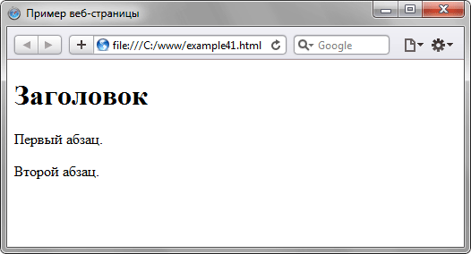

# Структура HTML-кода

Если открыть любую веб-страницу, то она будет содержать в себе типичные элементы, которые не меняются от вида и направленности сайта. В примере показан код простого документа, содержащего основные теги.

```HTML 
    <!DOCTYPE HTML PUBLIC "-//W3C//DTD HTML 4.01//EN" "http://www.w3.org/TR/html4/strict.dtd">
    <html>
      <head>
        <meta http-equiv="Content-Type" content="text/html; charset=utf-8">
        <title>Пример веб-страницы</title>
      </head>
      <body>
        <h1>Заголовок</h1>
        <!-- Комментарий -->
        <p>Первый абзац.</p>
        <p>Второй абзац.</p>
      </body>
    </html>
```



